# 🤝 AushilfApp – Nachbarschaftshilfe neu gedacht


> **Wir helfen Ihnen, eine helfende Hand zu finden – oder eine zu werden.**  
> _Eine App zur Vermittlung von lokaler Hilfe, entwickelt von [Wir helfen aus e.V.](https://www.wir-helfen-aus.de)_

---

## 📲 Die Idee

Die **AushilfApp** ist eine mobile App zur Vermittlung von Nachbarschaftshilfe – besonders für ältere Menschen, Studierende und Helfende mit wenig digitaler Erfahrung.  
Im Mittelpunkt stehen **Zugänglichkeit**, **Nützlichkeit im Alltag** und **einfache Vermittlung**.

Sie ist bereits testbar und vereint DSGVO-konforme Technologie mit echter sozialer Wirkung.

---

## 🧭 Hauptfunktionen für Nutzer:innen

| 🔹 Funktion                     | 📝 Beschreibung |
|-------------------------------|----------------|
| 📌 **Pinnwand**                | Posts in deiner Umgebung – ortsbasiert & nach Kategorien filterbar |
| 🗂 **Kategorien**              | Garten, Haushalt, Bildung, Gastro, Soziales, Handwerk |
| 🧭 **Location-Filter**         | Zeigt nur relevante Posts in deiner Nähe – Radius einstellbar |
| 💬 **Optimierter Chat**        | Barrierearme 1:1-Kommunikation  |
| 🔎 **Filterbare ChannelList**  | Chats lassen sich nach Kategorie, Status oder Kontext filtern |
| 🧑‍💼 **Userdaten-Verwaltung**  | Eigene Profildaten verwalten, Danksagungen empfangen & anzeigen |
| 🪪 **Minijob-Tunnel Integration** | Onboarding mit Stripe-Verifizierung zur Einbindung in Minijobzentralen |
| 📶 **Offline-Modus**           | Lokale SQLite-Datenbank für stabile Nutzung ohne Internet |
| 👀 **Barrierefreiheit**        | Schriftgrößenmodus, visuelle Avatar-Hilfe, einfache Sprache |

---

## 🎥 Walkthrough: So funktioniert die AushilfApp

### 📝 Barrierearmes Onboarding für ein schnelles Setup!

<div align="center">

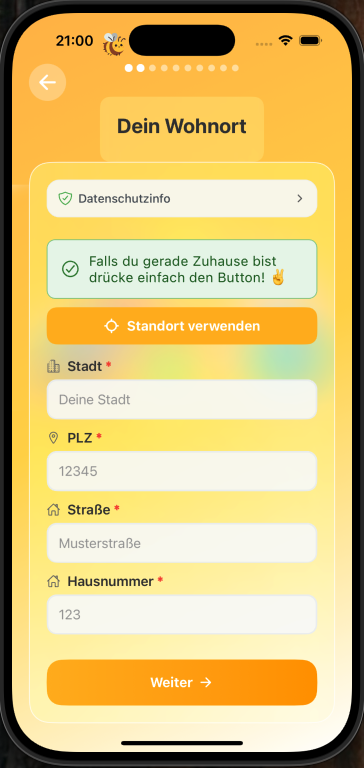 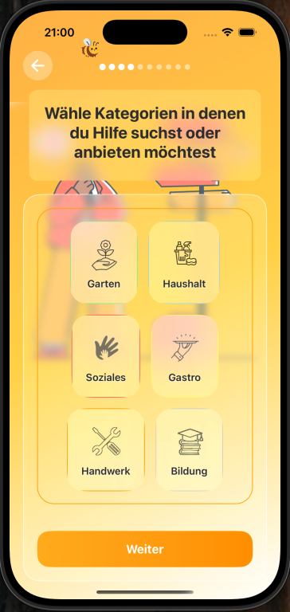 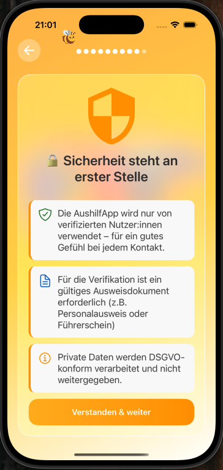

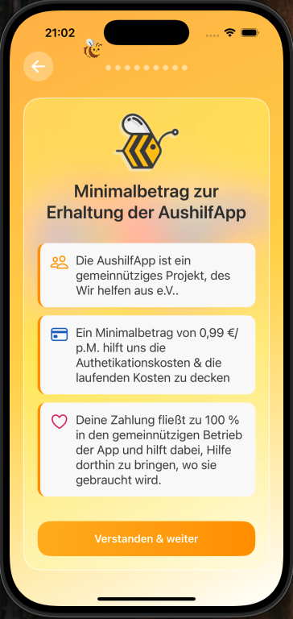 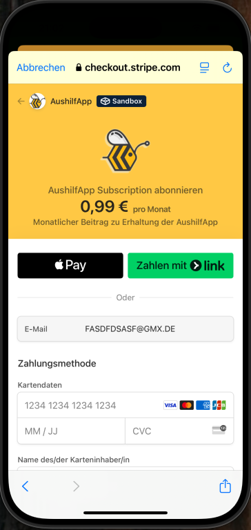 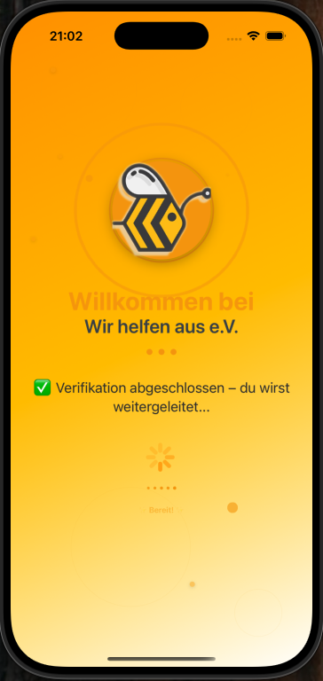

</div>

---

### 🧭 Intuitive Pinnwand mit leicht zugänglichen Posterstellungsprozess ✌️
Wähle deine Interessensbereiche wie Garten, Soziales oder Gastro.

<div align="center">

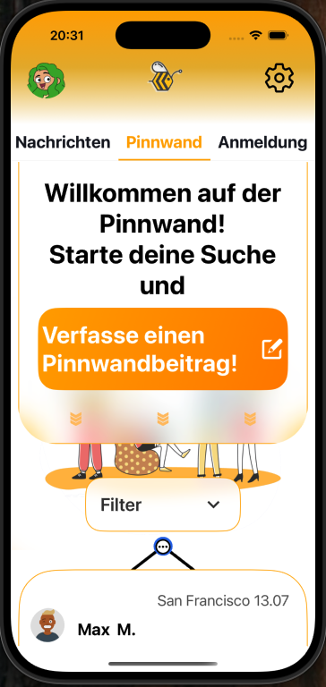  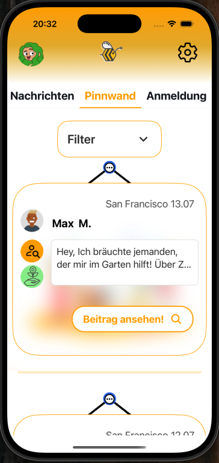

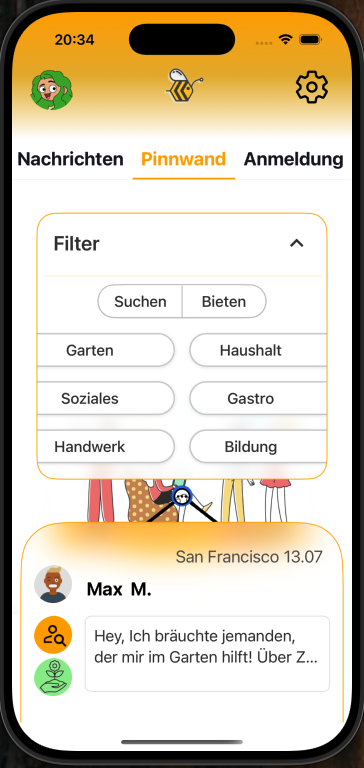 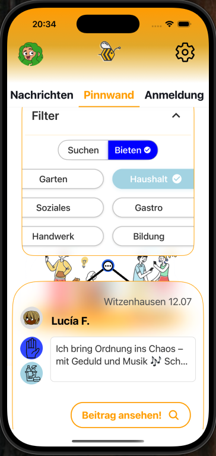

</div>

---

### 🐝 Trete in Kontakt mit Menschen denen du helfen Kannst!

<div align="center">

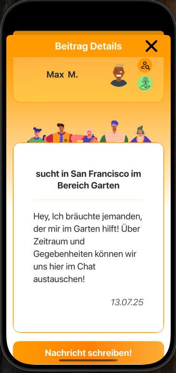  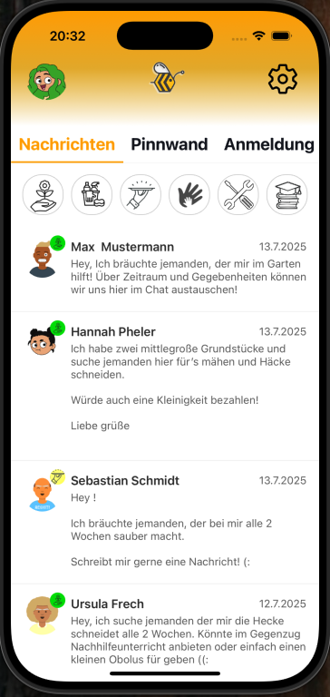

</div>

---

### 📌 Organisiere deine Aushilfen schnell und einfach mit der Kategorieauswahl in den Nachrichten!

<div align="center">

 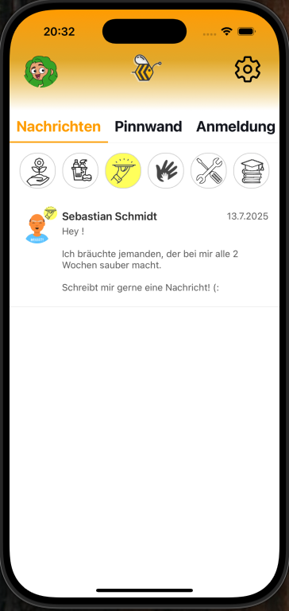 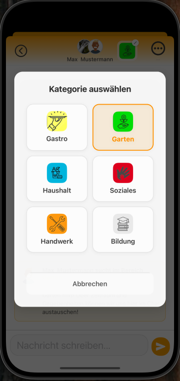

</div>

---

### 📔 Melde deine Aushilfmöglichkeit schnell und einfach mit den relevanten Daten bei der Minijobzentrale an

<div align="center">

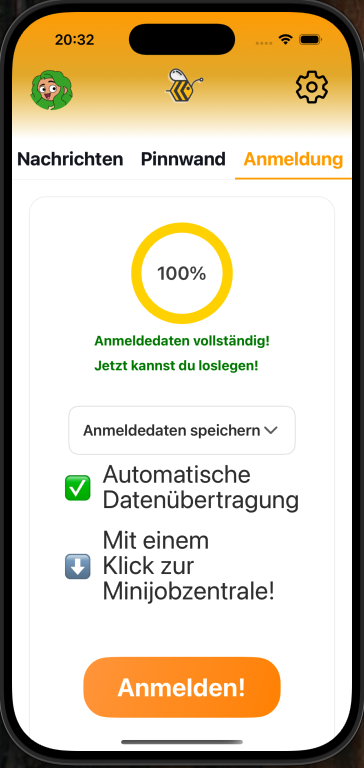

</div>

---

### 👥 Jeder User hat ein Profil in dem andere User Danksagungen hinterlassen können! Neben den Danksagungen sind dort auch ihre Interessen zu finden!

<div align="center">

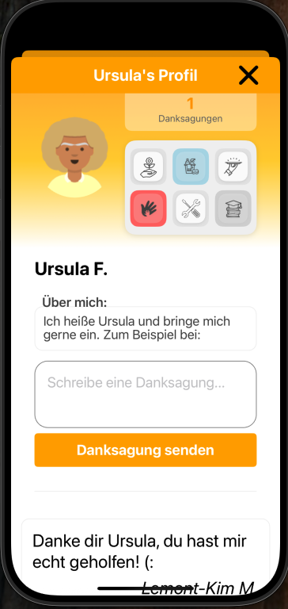 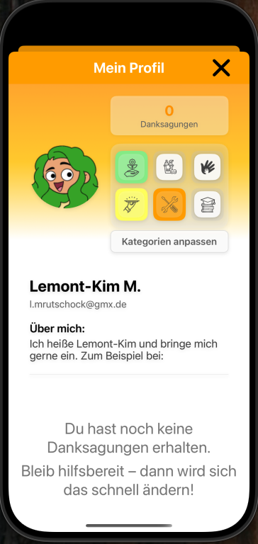 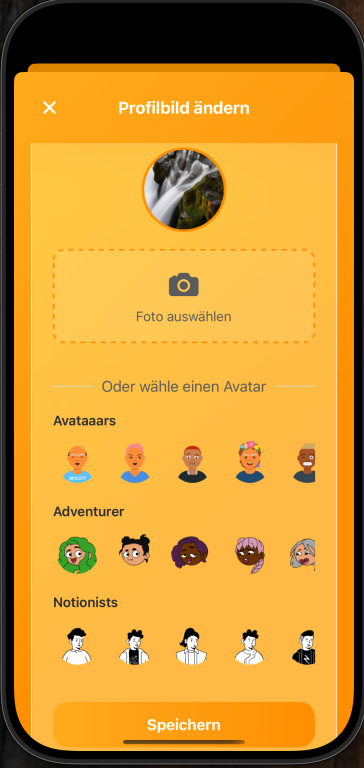

</div>

---

### ⚙️ Um die Zugänglichkeit der AushilfApp zu erhöhen, haben wir auch einen Lesemodus integriert für Menschen mit schwachen Augen!

<div align="center">

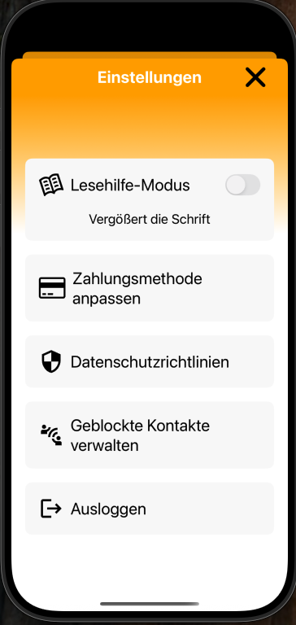 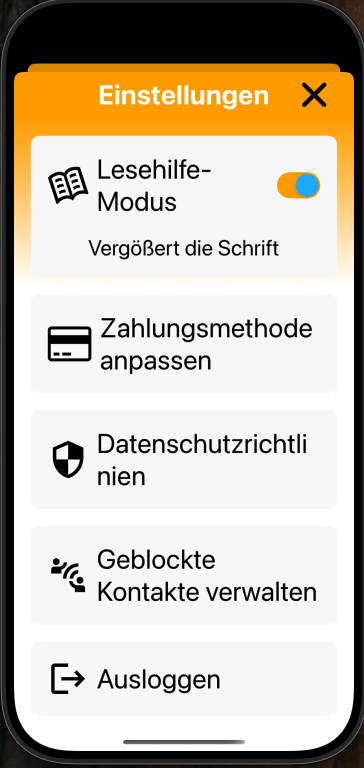

</div>

---

## 🚀 Technische Highlights

| Layer        | Technologie                          | Nutzen für App |
|-------------|---------------------------------------|----------------|
| 📱 **Frontend** | React Native + Expo                 | Plattformübergreifende App, schnelle UI-Entwicklung |
| 🔐 **Auth**     | Supabase OAuth + Stripe             | DSGVO-konforme Anmeldung mit Verifizierungsoption |
| 🧠 **State**    | Zustand Store + SQLite              | Lokale Datenhaltung für Offline-First Erlebnis |
| 💬 **Chat**     | getStream.io (v1) → eigene Lösung (v2) | Filterbarer, performanter Chat mit voller Kontrolle |
| 🛰 **Sync**     | Supabase Edge Functions             | Effiziente Synchronisation & Server-Funktionen |
| 📂 **DB**       | Supabase PostgreSQL + SQLite        | Kombiniert Cloud mit lokalem Cache |
| 🔎 **Toxicity** | ONNX + optional Flask API           | Lokaler Schutz vor toxischer Sprache – datenschutzfreundlich |
| 💼 **Verwaltung**| Stripe Identity Light (0,99 €)     | Nahtlose Integration in Minijobzentralen & Behördenprozesse |

---

## 🧑‍🤝‍🧑 Gemeinnützigkeit & Wirkung

Die AushilfApp ist ein gemeinnütziges Projekt des Vereins **Wir helfen aus e. V.**.  
Wir glauben an eine Gesellschaft, in der Hilfe auf Gegenseitigkeit basiert – unabhängig von Herkunft, Sprache oder digitaler Kompetenz.

### Was uns auszeichnet:

- 💡 **Zugang für alle**: auch ohne App über WhatsApp Companion möglich
- 🔒 **Privatsphäre & Kontrolle**: keine Weitergabe von Nutzerdaten
- 📚 **Begleitmaterialien**: leicht verständlich, mehrsprachig & barrierefrei
- 🫶 **Community getrieben**: Nutzer:innen können helfen, aber auch Hilfe suchen
- 💬 **KI-Unterstützung** intuitive Hilfe durch maßgeschneiderte Angebote mit den Aushelfern der AushilfApp 

---

## 🧪 Lokales Setup

```bash
git clone https://github.com/Elmundo93/aushilfapp.git
cd aushilfapp
yarn install
cp .env.example .env      # Supabase & Stripe Keys eintragen
npx expo start
```

---

## 🚧 Deployment

```bash
eas build --platform android|ios --profile preview
```

Die Konfiguration erfolgt über `eas.json`, `app.config.js` und `.env`.

---

## 👥 Kontakt & Mitwirken

- Verein: **Wir helfen aus e.V.**
- Vorstand: **Lemont-Kim Mrutschock**
- E-Mail: [Lemont-Kim@wir-helfen-aus.de](mailto:Lemont-Kim@wir-helfen-aus.de)
- Webseite: [www.wir-helfen-aus.de](https://www.wir-helfen-aus.de)

---

## 📜 Lizenz

MIT License – frei nutzbar, weiterentwickelbar und gemeinwohlorientiert.

---

## 💛 Danke

Danke an alle, die mithelfen. Gemeinsam bauen wir eine digitale Struktur, die echten sozialen Mehrwert bringt – **barrierefrei, inklusiv und lokal verankert**. 🐝